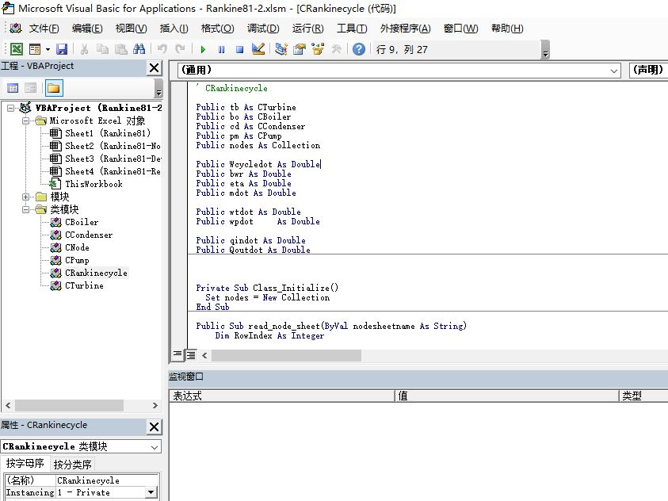

# The Programming Guide of Excel VBA 

##  Programming Environment

There are a few ways to open up the VBA Editor in Excel. 

* From the **Developer Tools** tab,  you can click the **Visual Basic** button. 

* A keyboard shortcut: press "Alt+F11" :

Whichever method you choose you should see a screen like this one:



##  Variables

A variable declare with word **Dim**

```vba
  Dim MyNumber As Integer
```
As well as declaring a variable to be of type **Integer**, you can also have the following numerical variable types:

```vba
Dim MyLong As Long
Dim MySingle As Single
Dim MyDouble As Double
Dim MyCurrency As Currency

Dim MyText As String

Dim MYVariable As Variant

```
One final variable type that can come in handy is **Variant**

* Variant is used when you're **not sure what value** will be returned. 

   It can hold numbers, text, and objects. However, using it too much can slow down your programmes, as it uses 16 bytes of data for numbers and 22 bytes for text.

## Conditional Logic

Conditional Logic is all about the **IF** word.

The structure of a VBA IF Statement looks like this:
```vab
If Condition_To_Test Then
   'CODE HERE'
End If
```

the **If** Statement with **Else** and **ElseIf**.

```vba
If Condition_To_Test Then
   'CODE HERE'
Else
   'CODE HERE'
End If
```
Not every condition can be reduced to a simple either/or. 

Quite often, you'll have more than two options you want to check for.

This is where **ElseIf** comes in. Here's the structure of an **ElseIf** Statement:
```vba
If Condition_To_Test Then
   'CODE HERE'
ElseIf Condition_To_Test Then
   'CODE HERE'
End If
```
You can have more than one ElseIf parts, as many as you need, in fact:
```vba
If Condition_To_Test Then
   'CODE HERE'
ElseIf Condition_To_Test Then
    'CODE HERE'
ElseIf Condition_To_Test Then
    'CODE HERE'
End If
```

Notice that the only difference between **If** and **ElseIf** is the word 

* **Else** tacked on to the word **If**.

You can also add an **Else** part, to catch anything you may have missed:

```vba
If Condition_To_Test Then
       'CODE HERE'
    ElseIf Condition_To_Test Then

Else
    'CODE HERE'
End If
···

### Conditional Operator.

If Statements, we've already used one conditional operator. 

Here's a table of them:

Operator Meaning
=    Has a value of

<   Less than

> Greater than

<= Less than or equal to

>= Greater than or equal to

< > Not equal to

### Logic Operators

To test for more than one condition, We need the Logic Operators. 

Here's a table of them:

Operator    Meaning
Not        Test if the value is NOT something

AND        Test for more than one condition

OR     Test if the value is either OR something

XOR    Test if one and only one value is true

### Select Case

Another way to select a value from a list of possible values is with a **Select Case** statement

```vba
Select Case User_Choice
    Case "R"
        MsgBox "Red"
    Case "G"
        MsgBox "Green"
    Case "B"
        MsgBox "Blue"
    Case Else
        MsgBox "None"
End Select

```
A Select Case statement begins with the words **Select Case**. 

You then type the thing you're testing for. This can be a variable, a number, text in double quotes, and even a built-in Excel function. 

For each possible answer, you then have one **Case**. Each Case is evaluated to TRUE or FALSE. If it's TRUE then the code for that Case gets executed. Only one Case per Select statement will get executed. 

You can have an optional **Case Else** to catch anything else that the value at the **User_Choice** could be

The whole thing ends with the words **End Select**.

You can check for more than one value by using the word To. 
For example, if you want to check a range of ages you can do it like this:
```vba
Case 0 To 35
```
You can also check several values at once. Simply separate each one with a comma:
```vba
Case 10, 20, 30, 40
```
### With ...End With
```vba
With object
   .property
End With
···

Look the  code like this:
```vba
ActiveCell.Font.Bold = True
ActiveCell.Font.Color = vbBlue
ActiveCell.Font.Name = "Arial"
ActiveCell.Font.Size = 22
ActiveCell.Font.Italic = True
```
We were accessing various properties of the ActiveCell. In the code above, we have ActiveCell five times. 

By using a With Statement, we can just type the ActiveCell.Font once.

Like this:
```vba
With ActiveCell.Font
    .Bold = True
    .Color = vbBlue
    .Name = "Arial"
    .Size = 22
    .Italic = True
End With
```

## Working with Strings of Text

Setting up a variable to hold text is quite straightforward. You simply Dim a variable As String:
```vba
Dim MyString As String
```
To store text inside of your variable you need to surround it with double quotes:
```vba
MyString = "Some text"
```
Quite often, though, you'll need to do something with the text that you get

The functions we'll study are these:
```vba
LCase, UCase
Trim and Len
Space 
Replace
StrReverse
InStr, InStrRev
Left, Right
```
## Programming Loops

### For Loop
The most common type of loop is called a **For** Loop
```vba
Sub LoopExample()
    Dim StartNumber As Integer
    Dim EndNumber As Integer
    EndNumber = 5
    
    For StartNumber = 1 To EndNumber
        MsgBox StartNumber
    Next StartNumber

End Sub
```
### For Each loops

**For Each** loops are normally used with collections and arrays
```vba
For Each variable_name In collection_name

Next variable_name
```
For Example

```vba
For Each MyCell In Range("A2:A6")
   MyCell.Value = Replace(MyCell.Value, "-", "")
Next MyCell
```
## Cells Property

The Cells property has an **Item** property that you use to reference the cells on your spreadsheet:
```
Cells.Item(Row, Column)
```
The **Row** is always a **number**. But the **column** can be **a number or letter**:
```
Cells.Item(1, 1)
Cells.Item(1, "A")
``
Both the lines above refer to the cell **A1**. 

You can shorten this even further and get rid of the Item property altogether:
```
Cells(1, 1)
Cells(1, "A")
``
The reason why we're discussing the Cells property is because it's very useful in programming loops. 

That's because you can replace the numbers between round brackets with a value from your loop. Let's clear that up.
```
Dim StartNumber As Integer
Dim EndNumber As Integer
EndNumber = 5
For StartNumber = 1 To EndNumber
    Cells(StartNumber, "A").Value = StartNumber
Next StartNumber
```

## Do Loops

There are two kinds of Do loops in Excel VBA,

* Do While
* Do Until. 

Let's take a look at the **Do While** loop first.

```
Do While counter < 5
   counter = counter + 1
Loop
```
```
Do
  counter = counter + 1
Loop While counter < 5
```
### Do Until
```
Do Until counter > 5 
   counter = counter + 1
Loop
```
Now we're saying Do Until counter is greater than 5.

## Programming Arrays

 An array is a way to store more than one value under the same name. An array looks like this when it is declared:
``` 
Dim MyArray(4) As Integer
```
However, one important point to bear in mind is that

*  the first position in the array is **0**.

 So the above array can actually hold 5 values, 0 to 4

If you don't want the first position to be 0 then you can declare it like this:

``` 
Dim MyArray(1 To 5) As Integer
``` 

This time, the first position in the array is 1. The number of values it can hold would then go from 1 to 5.

* Programming Arrays and Loops
``` 
For i = 1 To UBound(MyArray)

``` 
### Multidimensional Arrays
``` 
Dim MyArray(5, 4) As Integer
Dim MyArray(1 To 5, 1 To 6) As Integer
``` 
To store data in the first row, add these lines:
···
MyArray(0, 0) = 10
MyArray(0, 1) = 10
MyArray(0, 2) = 10
MyArray(0, 3) = 10
···
### Split Function
···
Split(text_here, separator)
···

* The Join Function
You can put the pieces of an array back together again with the **Join** function.

 If you want, you can have the same separator as before, but you can also have a new one. In the code below, we first have a name separated by spaces. We then use Join to put the name back together again, but this time separated by hyphens.

···
Dim txt As String
Dim FullNameSpaces As Variant
Dim FullNameHyphens As Variant
txt = "David LLoyd George"
FullNameSpaces = Split(txt, " ")

FullNameHyphens = Join(FullNameSpaces, "-")
···

## Reference

* Getting Started with VBA in Office 2010
  
   https://msdn.microsoft.com/library/office/ee814735(v=office.14)
   
* Excel VBA Programming

   http://www.homeandlearn.org/the_excel_vba_editor.html