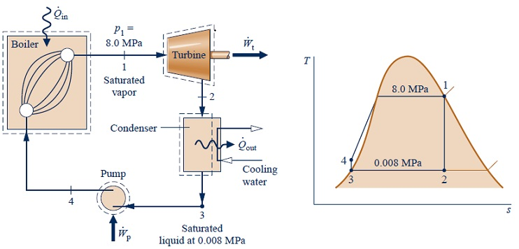

# Rankine Cycle with Excel VBA

   Programming Rankine Cycle simulator with Excel VBA

## Dependences

   * Microsoft Excel 2010 above

   * IAPWS-IF97 DLL https://github.com/PySEE/SEUIF97   

## The Example of Rankine Cycle

 Michael J . Mora. Fundamentals of Engineering Thermodynamics(7th Edition). John Wiley & Sons, Inc. 2011

Chapter 8 : Vapour Power Systems 
        
**Example 8.1: Analyzing an Ideal Rankine Cycle  Page 438**

   * Steam is the working fluid in an ideal Rankine cycle. 

   * Saturated vapor enters the turbine at 8.0 MPa 
   
   * Saturated liquid exits the condenser at a pressure of 0.008 MPa. 

   * The net power output of the cycle is 100 MW.

   * Cooling water enters the condenser at 15°C and exits at 35°C.

* Determine for the cycle

  * the thermal efficiency, %

  * the back work ratio,  %

  * the mass flow rate of the steam,in kg/h,

  * the rate of heat transfer, Qin, into the working fluid as it passes through the boiler, in MW,

  * the rate of heat transfer, Qout, from the condensing steam as it passes through the condenser, in MW,

  * the mass flow rate of the condenser cooling water, in kg/h

## The Excel Workbooks of Rankine Cycle

* 1 Rankine81-0.xlsm

   Programming through the calculating formulas directly 

* 2 Rankine81-1.xlsm
  
   Programming the Rankine Cycle Simulator based on the topology structure with Structure and Function of VBA

* 3 Rankine81-2.xlsm
   
   Programming the Rankine Cycle Simulator based on the topology structure with VBA Class
    
